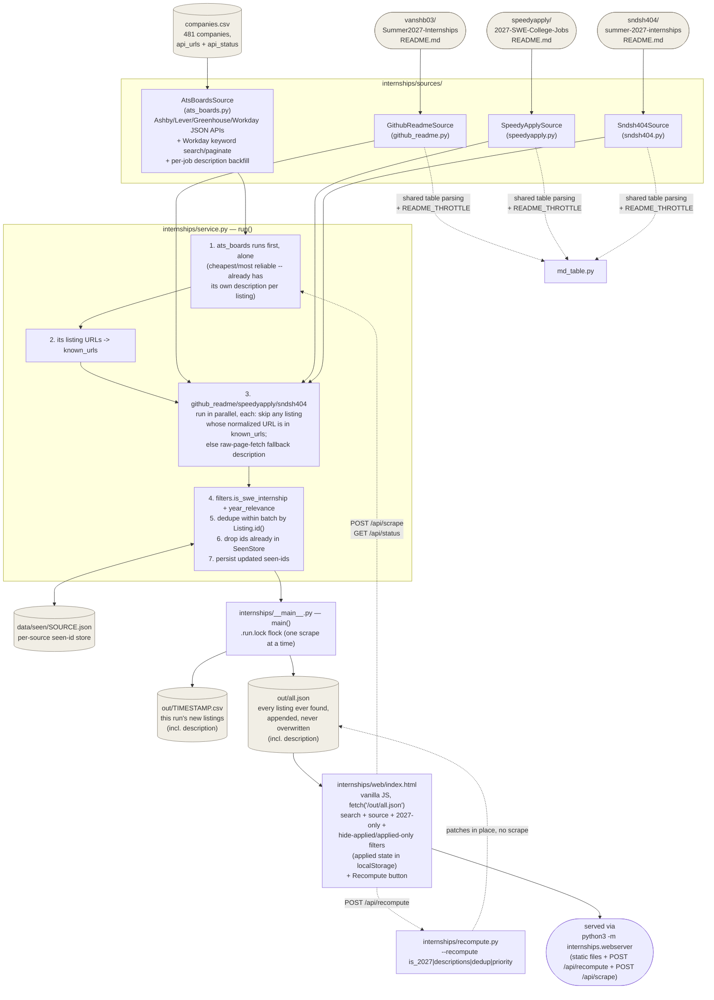

# Architecture

A stdlib-only Python backend that hunts SWE internships across multiple
sources, plus a static web UI over the results. No database, no framework,
no external dependencies.

## Flow

## Components

| File | Responsibility |
|---|---|
| `internships/models.py` | `Listing` dataclass — the one shape every source produces. `normalize_url()` (module-level helper) strips query string/fragment; used both by `id()`'s dedup identity (sha1 of source+company+normalized-url+location) and by `service.py` for cross-source URL matching. `is_2027` is a property computed from `filters.year_relevance(title, location, extra_text)`, not a hardcoded year match. `priority` is a property computed from `filters.company_priority(company)`. |
| `internships/filters.py` | `is_swe_internship(title)` (regex) and `year_relevance(title, location, extra_text)` (drops titles that explicitly name a non-2027 year; title/location are authoritative, the description body can only confirm 2027, never veto). `company_priority(company)` -- 3-tier classification (1 = big tech/absolute top tier, 2 = solid mid tech, 3 = everything else/default) via a case-insensitive match against hand-curated `PRIORITY_1_COMPANIES`/`PRIORITY_2_COMPANIES` sets. |
| `internships/seen_store.py` | `SeenStore` — a JSON file of previously-reported listing ids, one per source. This *is* the dedup mechanism across runs; there's no snapshot/diff machinery. |
| `internships/sources/ats_boards.py` | Reads `companies.csv`, fetches each company's Ashby/Lever/Greenhouse/Workday JSON endpoint (per-domain throttled via `DomainThrottle`, concurrent across domains), extracts postings into `Listing`s, resolves Workday's relative URLs to absolute ones, writes `api_status` back to the CSV. Workday postings are additionally keyword-searched ("intern"/"co-op", merged + deduped) and paginated up to a cap, and get a per-job description backfilled from Workday's detail endpoint for postings that already look like an SWE internship by title. Also defines `DomainThrottle`, reused by `md_table.py` and `service.py`. |
| `internships/sources/{github_readme,speedyapply,sndsh404}.py` | Fetch a tracked repo's `README.md`, parse its job table into `Listing`s. Each repo's table dialect differs slightly (marker comments or not, HTML links vs. markdown links, company-continuation rows or not) — handled per-source. |
| `internships/sources/md_table.py` | Shared table-parsing primitives used by the three README sources: `extract_rows` (marker-delimited tables), `extract_table_by_header` (unmarked tables, located by header row), `clean_text`, `extract_href`/`extract_md_link`, `is_closed`. Also holds `README_THROTTLE`, a single shared `DomainThrottle` instance so the three sources (all hitting raw.githubusercontent.com concurrently) still space out per-domain. |
| `internships/service.py` | `run(sources)` — runs `ats_boards` first, alone, then the rest in parallel; applies the filters, dedupes, persists seen-ids, returns what's new. The non-ats_boards sources skip any listing whose normalized URL exactly matches one `ats_boards` already found this run, and fall back to a raw/unparsed page fetch (own `DomainThrottle` instance) for their own listing's URL otherwise, since they carry no description of their own. One bad source degrades to a `SourceResult(error=...)` rather than taking down the run. |
| `internships/__main__.py` | CLI entrypoint (`python3 -m internships`). Takes a `.run.lock` flock for the process lifetime so two scrapes can't race each other's writes. Writes this run's new listings to `out/<timestamp>.csv` and appends metadata to the cumulative `out/all.json` (no description field). Descriptions go to `out/descriptions.json` keyed by listing id. `--recompute FIELD...` skips scraping and calls into `recompute.py` instead. |
| `internships/desc_store.py` | `out/descriptions.json.gz` — gzip JSON `{listing_id: full apply-page HTML}`. Keeps multi‑MB bodies out of `all.json`. Gitignored; local-only. |
| `internships/recompute.py` | `--recompute` implementation — patches `out/all.json` in place, no scrape: `is_2027` (recompute against current `filters.year_relevance`), `descriptions` (re-fetch into `descriptions.json` for any id missing one), `dedup` (merge rows that are the same job link under today's rules, always keeping the oldest record), `priority` (recompute the 1/2/3 tier against current `filters.company_priority`). Writes atomically (`.tmp` + `replace`). |
| `internships/webserver.py` | Static file server for the web UI (`SimpleHTTPRequestHandler`, same behavior as plain `http.server`) plus JSON endpoints -- `POST /api/recompute?fields=dedup,is_2027,priority,descriptions` + `GET /api/recompute/status`, `POST /api/scrape` (runs a real scrape via `service.run(SOURCES)`, reusing `__main__.py`'s `write_csv`/`append_all_json`) + `GET /api/scrape/status`, and `GET /api/status` (non-blocking probe of whether `.run.lock` is held by ANY process -- this server, another tab, or a bare terminal scrape/`--recompute` -- so the frontend's live indicator works regardless of trigger source). All scrape/recompute work runs in a background thread guarded by the same `.run.lock`. No auth; localhost-only tool. |
| `internships/web/index.html` | Single static file, no build step. Fetches `out/all.json`, renders a reverse-chronological feed grouped by scrape run, with search/source/2027-only/P1+P2-only/P1-only/hide-applied/applied-only filters. Priority-1/2 listings get a "P1"/"P2" badge next to the title (priority 3 is unbadged). A per-row checkbox marks a listing "applied"; that state (and its timestamp, shown as "Applied Xh ago") lives only in the browser's `localStorage`, so it survives `out/all.json` being regenerated. A "Recompute" row in the filter panel POSTs to `/api/recompute` and polls status; a "Run scrape" button in the header POSTs to `/api/scrape` and polls `/api/status` for a live "scrape running..." indicator. Both need `internships/webserver.py` (not plain `http.server`) to work. |

## Adding a source

Write a class with `.name: str` and `.fetch() -> list[Listing]`, register it
in `SOURCES` in `internships/__main__.py`. Everything downstream (filtering,
dedup, output, web UI) is source-agnostic.

## Scheduled scrape

`scripts/` holds a `launchd` LaunchAgent (not `cron` -- cron on macOS doesn't
reliably catch up a missed run when the machine was asleep/off; `launchd`'s
`StartInterval` does) that runs `python3 -m internships` roughly every 2
hours, forever, starting at login:

- `scripts/com.internships.scrape.plist` -- `StartInterval` 7200s + `RunAtLoad`.
- `scripts/scrape_cron.sh` -- the actual wrapper `launchd` invokes. Sleeps a
  uniform random `[0, 1200]`s (0-20min) before running, giving a symmetric
  +/-10min jitter around the 2h mark -- not a one-sided delay, which would
  bias every run late. Uses absolute paths throughout (`launchd` doesn't
  source `.zshrc`/`.bash_profile`, so `python3` on `$PATH`/pyenv shims won't
  resolve). Relies entirely on `internships/__main__.py`'s own `.run.lock`
  for concurrency -- if a previous run (or a web-UI-triggered one) is still
  going, this just no-ops.
- `scripts/install_cron.sh` -- (re)installs the LaunchAgent; safe to re-run
  after editing the plist or wrapper.

Logs: `~/Library/Logs/internships-scrape.log`. Check status:
`launchctl list com.internships.scrape` (running with PID = active/recently
ran; missing = not loaded). Uninstall:
`launchctl bootout gui/$(id -u)/com.internships.scrape` then delete
`~/Library/LaunchAgents/com.internships.scrape.plist`.

One-time manual step this needed on this machine: `~/Documents` is under
macOS's TCC "Full Disk Access" protection, and grants to an interactive
shell's parent app don't propagate to fresh processes `launchd` spawns --
both `/bin/bash` and the `python3` interpreter needed to be added to
System Settings -> Privacy & Security -> Full Disk Access manually before
the LaunchAgent could read/write the repo.

## What's deliberately not here

- **No database** — `data/seen/*.json` + `out/all.json` are the entire persisted state.
- **No fuzzy cross-source dedup** — `ats_boards` runs first each run and the README-table sources skip anything whose exact (normalized) URL it already found, but the same job reached via different URLs, or found by two README trackers before either sees `ats_boards`'s link, can still appear more than once. Accepted, not a bug.
