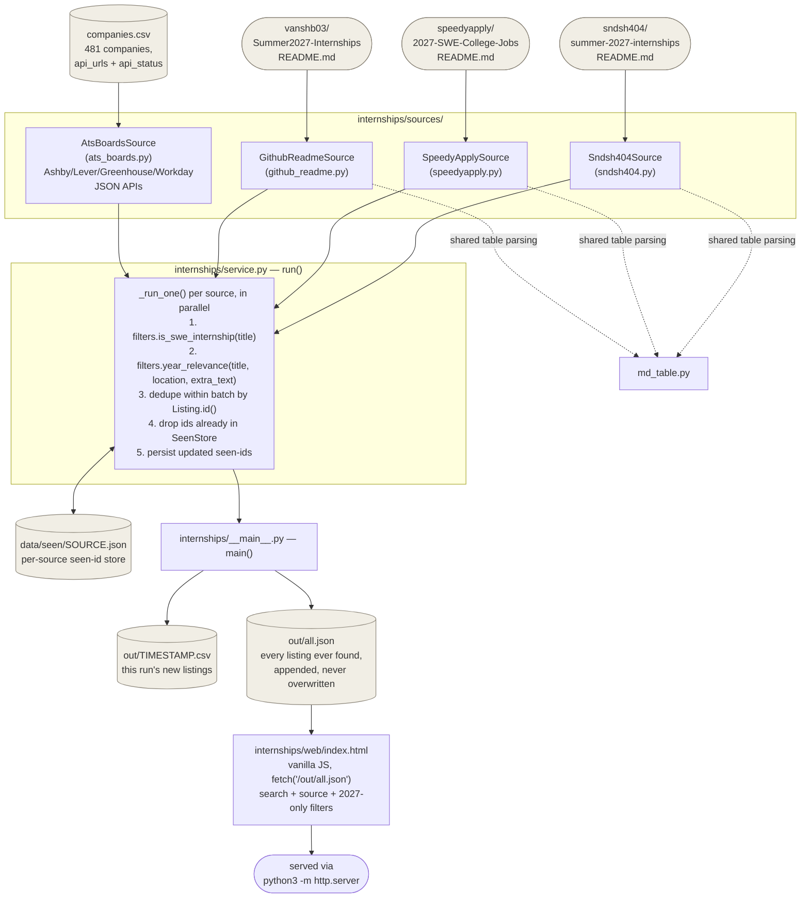

# Architecture

A stdlib-only Python backend that hunts SWE internships across multiple
sources, plus a static web UI over the results. No database, no framework,
no external dependencies.

## Flow

## Components

| File | Responsibility |
|---|---|
| `internships/models.py` | `Listing` dataclass — the one shape every source produces. `id()` gives a stable identity for dedup (sha1 of source+company+url+location); `is_2027` is a display-only flag. |
| `internships/filters.py` | `is_swe_internship(title)` (regex) and `year_relevance(title, location, extra_text)` (drops titles that explicitly name a non-2027 year; title/location are authoritative, the description body can only confirm 2027, never veto). |
| `internships/seen_store.py` | `SeenStore` — a JSON file of previously-reported listing ids, one per source. This *is* the dedup mechanism across runs; there's no snapshot/diff machinery. |
| `internships/sources/ats_boards.py` | Reads `companies.csv`, fetches each company's Ashby/Lever/Greenhouse/Workday JSON endpoint (per-domain throttled, concurrent across domains), extracts postings into `Listing`s, resolves Workday's relative URLs to absolute ones, writes `api_status` back to the CSV. |
| `internships/sources/{github_readme,speedyapply,sndsh404}.py` | Fetch a tracked repo's `README.md`, parse its job table into `Listing`s. Each repo's table dialect differs slightly (marker comments or not, HTML links vs. markdown links, company-continuation rows or not) — handled per-source. |
| `internships/sources/md_table.py` | Shared table-parsing primitives used by the three README sources: `extract_rows` (marker-delimited tables), `extract_table_by_header` (unmarked tables, located by header row), `clean_text`, `extract_href`/`extract_md_link`, `is_closed`. |
| `internships/service.py` | `run(sources)` — fetches every source in parallel, applies the filters, dedupes, persists seen-ids, returns what's new. One bad source degrades to a `SourceResult(error=...)` rather than taking down the run. |
| `internships/__main__.py` | CLI entrypoint (`python3 -m internships`). Writes this run's new listings to `out/<timestamp>.csv` and appends them to the cumulative `out/all.json`. |
| `internships/web/index.html` | Single static file, no build step. Fetches `out/all.json`, renders a reverse-chronological feed grouped by scrape run, with search/source/2027-only filters. |

## Adding a source

Write a class with `.name: str` and `.fetch() -> list[Listing]`, register it
in `SOURCES` in `internships/__main__.py`. Everything downstream (filtering,
dedup, output, web UI) is source-agnostic.

## What's deliberately not here

- **No scheduling** — run `python3 -m internships` manually or cron it yourself.
- **No database** — `data/seen/*.json` + `out/all.json` are the entire persisted state.
- **No cross-source dedup** — the same job can appear once per source that lists it (e.g. found by both `ats_boards` and a README tracker). Accepted, not a bug.
