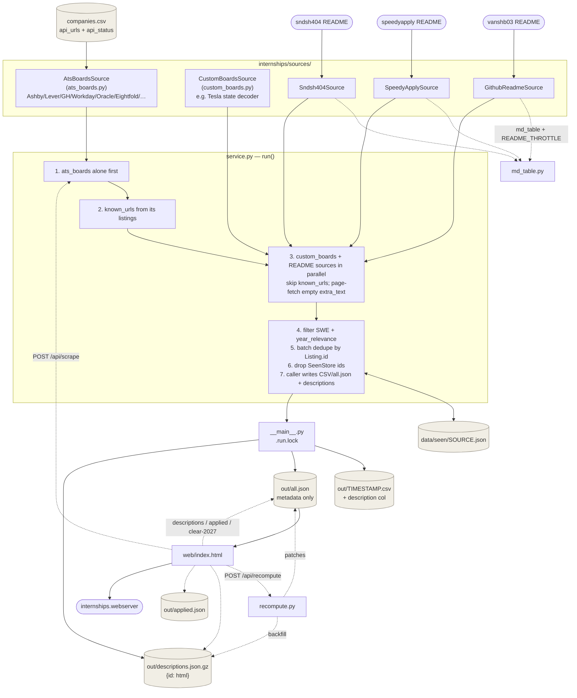

# Architecture

A stdlib-only Python backend that hunts SWE internships across multiple
sources, plus a static web UI over the results. No database, no framework,
no external dependencies.

## Flow

## Components

| File | Responsibility |
|---|---|
| `internships/models.py` | `Listing` dataclass. `normalize_url()` for dedup identity. `is_2027` / `priority` are properties from filters. |
| `internships/filters.py` | `is_swe_internship`, `year_relevance` (2027 / maybe / no), `company_priority` tiers 1–3. |
| `internships/seen_store.py` | Per-source JSON of already-reported listing ids. Cross-run dedup. Persist deferred until after `all.json` write succeeds. |
| `internships/sources/ats_boards.py` | `companies.csv` ATS sweep + `DomainThrottle` (per-netloc lock + min interval via `hold()`). |
| `internships/sources/custom_boards.py` | Non-generic boards (Tesla, etc.) with per-company decoders. |
| `internships/sources/{github_readme,speedyapply,sndsh404}.py` | Tracked README job tables. |
| `internships/sources/md_table.py` | Shared README table parsing + shared `README_THROTTLE`. |
| `internships/service.py` | `run(sources)`: ats_boards first, then others in parallel; filters; seen; page-fetch when `extra_text` empty (all sources). |
| `internships/__main__.py` | CLI + lock. CSV + append `all.json` + `desc_store` put. Registers all five sources. |
| `internships/desc_store.py` | `out/descriptions.json.gz` — `{listing_id: html}`. Legacy migrate from plain JSON / per-id `.html.gz`. |
| `internships/applied_store.py` | `out/applied.json` — `{listing_id: ISO timestamp}` for the UI applied checkbox. |
| `internships/recompute.py` | In-place `all.json` patches: `is_2027` (honors `is_2027_override: false`), `priority`, `dedup` (URL + company/title/location with job-token guard), `descriptions` backfill, `clear_is_2027(id)`. |
| `internships/webserver.py` | Static files + scrape/recompute/status + descriptions + applied + clear-2027 APIs. Background threads; shared `.run.lock`. |
| `internships/web/index.html` | Vanilla FE: filters (persisted), Scrape/Recompute (mutex + recompute field popup), applied (server∪localStorage), last-opened Apply highlight, clear-2027 confirm, missing-desc submit, company applied siblings. |

## Web API

| Method | Path | Notes |
|---|---|---|
| `POST` | `/api/scrape` | 202 or 409 if scrape already running |
| `GET` | `/api/scrape/status` | `{running, result, error}` |
| `POST` | `/api/recompute?fields=dedup,is_2027,…` | 202 / 400 / 409 |
| `GET` | `/api/recompute/status` | `{running, result, error}` |
| `GET` | `/api/status` | `{active}` — any holder of `.run.lock` |
| `GET` | `/api/descriptions/ids` | `{ids: [...]}` |
| `POST` | `/api/descriptions` | body `{id, text}` |
| `GET` | `/api/applied` | full map |
| `POST` | `/api/applied` | replace map; `?merge=1` unions (later ISO wins) |
| `POST` | `/api/listings/clear-2027` | body `{id}` → `is_2027=false`, `is_2027_override=false` |

## Adding a source

Class with `.name: str` and `.fetch() -> list[Listing]`, append to `SOURCES`
in `__main__.py`. Filtering, dedup, storage, and the UI are source-agnostic
(aside from source chip labels/colors in `index.html`).

## Scheduled scrape

`scripts/` holds a `launchd` LaunchAgent (not cron — better sleep catch-up on
macOS) that runs `python3 -m internships` about every 2 hours:

- `scripts/com.internships.scrape.plist` — `StartInterval` 7200s + `RunAtLoad`
- `scripts/scrape_cron.sh` — 0–20min random sleep (±10min jitter), absolute paths
- `scripts/install_cron.sh` — (re)install LaunchAgent

Concurrency relies on `.run.lock` (UI scrape / CLI / agent all share it).

Logs: `~/Library/Logs/internships-scrape.log`.  
Status: `launchctl list com.internships.scrape`.  
Uninstall: `launchctl bootout gui/$(id -u)/com.internships.scrape` and remove
`~/Library/LaunchAgents/com.internships.scrape.plist`.

If the repo is under `~/Documents`, grant Full Disk Access to `/bin/bash` and
the `python3` binary used by the agent (TCC does not inherit shell grants).

## What's deliberately not here

- **No database** — `data/seen/*.json`, `out/all.json`, `descriptions.json.gz`,
  and `applied.json` are the persisted state.
- **No fuzzy cross-source dedup of all URL variants** — `ats_boards` runs first
  and other sources skip exact normalized URLs it found; recompute `dedup` also
  collapses same company+title+location (with job-token guard). Distinct URLs
  for the same human job can still appear; accepted, not always a bug.
- **No auth on webserver** — localhost personal tool only.
